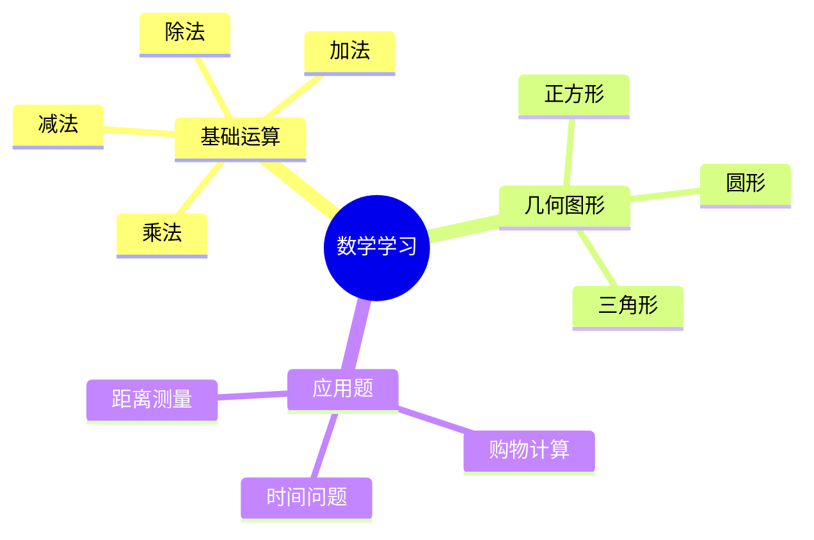

+++
date = '2025-01-01T20:00:00+08:00'
draft = false
title = 'Goxue Engine：专为儿童设计的互动式教育平台'
description = '分享我开发的面向儿童的互动式教育平台，包含Canvas动画、Mermaid思维导图等创新功能'
tags = ['Go语言', 'Vue.js', '教育科技', 'Beego', '开源项目']
+++

# Goxue Engine：专为儿童设计的互动式教育平台

大家好！今天我想和大家分享我最近开发的一个开源项目——**Goxue Engine**。这是一个专门为儿童设计的互动式教育平台，集成了多种现代化的技术栈和创新的教学功能。

## 项目背景

作为教育科技领域的探索者，我发现现有的教育平台大多缺乏互动性和趣味性。孩子们在使用传统教育软件时，往往感到枯燥无味，学习效果不佳。因此，我决定开发一个更加生动有趣的教育平台，让学习变成一种享受。

## 🚀 核心特性

### 1. 强大的内容创作工具

#### Markdown 编辑器
基于 `v-md-editor` 的专业级Markdown编辑器，让内容创作变得简单直观。支持实时预览、代码高亮等功能。

```markdown
# 数学知识点

今天我们来学习加法运算：

$$a + b = c$$

通过可视化动画来理解这个概念...
```

#### Canvas 动画展示
这是项目的一个亮点功能！支持自定义JavaScript动画代码，实现交互式问题解析。

**主要功能：**
- 🎬 重播动画功能
- 🖥️ 全屏播放支持  
- 📱 响应式画布尺寸适配
- ⚡ 流畅的动画性能

```javascript
// 数学动画示例：加法过程可视化
function drawAddition(a, b) {
  const canvas = document.getElementById('math-canvas');
  const ctx = canvas.getContext('2d');
  
  // 绘制第一组物体
  for(let i = 0; i < a; i++) {
    drawCircle(50 + i * 40, 100, 15, '#ff6b6b');
  }
  
  // 绘制第二组物体
  for(let i = 0; i < b; i++) {
    drawCircle(50 + i * 40, 150, 15, '#4ecdc4');
  }
  
  // 动画效果：合并过程
  animateMerge();
}
```

#### Mermaid 思维导图
支持多种图表类型，让抽象概念可视化：



### 2. 交互式图表控制

为了提升用户体验，我实现了强大的图表交互功能：

- **🔍 缩放功能**：放大/缩小思维导图，查看细节
- **🤏 拖拽平移**：自由拖动查看大型图表
- **🔄 旋转视图**：支持±90°旋转查看
- **🔙 重置视图**：一键恢复默认视图
- **🖥️ 全屏模式**：沉浸式查看体验

这些功能基于 `svg-pan-zoom` 库实现，为用户提供了类似专业制图软件的体验。

### 3. 完善的用户系统

#### 微信一键登录
集成微信授权，让用户能够快速、安全地登录系统。

#### 角色权限管理
- **User 角色**：普通用户，可以创建和浏览内容
- **Admin 角色**：管理员，负责内容审核和用户管理

### 4. 内容管理系统

#### 审核流程
建立了完善的内容审核机制，确保平台内容的质量和安全性。

#### 分类管理
支持内容的精细化分类和标签管理。

#### 公开访问
支持未登录用户浏览文章详情页，降低使用门槛。

## 🏗️ 技术架构

### 后端技术栈

```
Go 1.21+     │  Beego v2      │   MySQL
   ⬇            ⬇              ⬇
高性能         模块化           可靠存储
```

- **语言**: Go 1.21+ - 优秀的并发性能
- **框架**: Beego v2 - 成熟的Go Web框架
- **数据库**: MySQL - 稳定可靠的数据存储
- **架构**: 模块化分层架构 (RESTful API)

### 前端技术栈

```
Vue 3        │  TypeScript    │  Element Plus
   ⬇            ⬇              ⬇
组件化         类型安全         丰富组件
```

- **框架**: Vue 3 + TypeScript - 现代化的前端开发
- **UI 库**: Element Plus - 美观的UI组件库
- **构建工具**: Vite - 快速的开发构建工具
- **状态管理**: Pinia - Vue 3推荐的状态管理
- **编辑器**: 
  - `@kangc/v-md-editor` (Markdown编辑器)
  - `mermaid` (图表渲染引擎)

### 移动端 (可选)

```
uni-app      │  Vue 3        │  多端编译
   ⬇            ⬇              ⬇
跨平台         组合式API        H5/小程序
```

使用 unibest 框架，支持编译为 H5 或微信小程序，覆盖更多使用场景。

## 🎯 项目亮点

### 1. 创新性教学方式
- **可视化学习**：通过Canvas动画让抽象概念具象化
- **交互式图表**：思维导图支持缩放、拖拽、旋转操作
- **沉浸式体验**：全屏模式提供专注的学习环境

### 2. 技术先进性
- **现代化技术栈**：Go + Vue 3，确保系统的性能和可维护性
- **模块化设计**：清晰的项目结构，便于扩展和维护
- **响应式设计**：适配各种设备尺寸

### 3. 实用性功能
- **内容审核**：确保平台内容质量
- **权限管理**：灵活的用户角色控制
- **公开访问**：降低使用门槛，扩大受众

## 🚀 开发体验分享

### 开发过程中的挑战

#### 1. Canvas动画优化
初期Canvas动画在移动设备上性能不佳，通过以下优化解决了问题：
- 使用 `requestAnimationFrame` 优化渲染循环
- 实现画布尺寸的智能适配
- 添加动画帧率控制

#### 2. Mermaid图表交互
为了让Mermaid图表支持复杂的交互操作，我：
- 集成 `svg-pan-zoom` 库
- 自定义交互事件处理
- 实现视图状态管理

#### 3. 前后端分离架构
- 使用CORS解决跨域问题
- 实现JWT token认证
- 建立统一的API响应格式

### 学习收获

这个项目让我深入掌握了：

1. **Go语言开发**：从语法到并发编程的全面实践
2. **Vue 3生态**：组合式API、TypeScript集成、现代构建工具
3. **教育产品设计**：从用户需求到功能实现的完整流程
4. **全栈开发能力**：前后端协调开发和部署

## 🔮 未来规划

短期目标：
- [ ] 需求反馈系统
- [ ] 移动端H5/小程序适配
- [ ] 评分系统
- [ ] 智能搜索功能

长期愿景：
- [ ] AI驱动的个性化学习推荐
- [ ] 多语言国际化支持
- [ ] VR/AR教学场景
- [ ] 教师端管理工具

## 🤝 开源贡献

Goxue Engine是一个完全开源的项目，我希望能够：

1. **帮助其他开发者**：学习现代化的全栈开发技术
2. **推动教育科技发展**：为教育行业提供开源解决方案
3. **建立开发者社区**：连接志同道合的开发者

**项目地址**：https://gitee.com/zhangerhao/goxue_-engine.git

## 💡 总结

Goxue Engine不仅仅是一个技术项目，更是我对教育科技未来的一次探索。通过这个项目，我证明了现代化的技术栈可以为教育领域带来创新的解决方案。

我希望这个项目能够：
- 🎓 **激发孩子们的学习兴趣**
- 👨‍💻 **帮助开发者学习新技术**
- 🚀 **推动教育科技的发展**

欢迎大家访问项目仓库，了解更多细节，也期待大家的宝贵建议和贡献！

---

*如果你对教育科技或全栈开发感兴趣，欢迎与我交流讨论。让我们一起用技术改变教育！*

#开源项目 #教育科技 #Go语言 #Vue.js #全栈开发